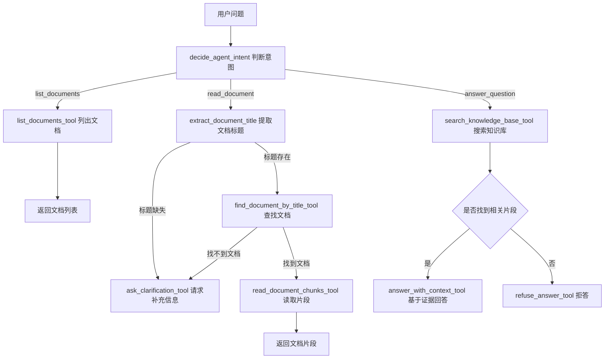

# Agent 阶段复盘

这份文档用于记录当前 Simple Agent 阶段的学习成果。它不是最终简历稿，也不是最终项目总结，而是一个阶段性“知识地图”：帮助我确认自己已经理解了哪些代码结构、业务逻辑和 Agent 思想。

## 1. 当前阶段定位

当前项目已经从普通 RAG 问答，进入到了 Agent 雏形阶段。

目前实现的是一个手写版 Simple Agent，还不是 LangGraph 版本。它已经具备 Agent 的几个核心特征：

- 能根据用户问题判断意图。
- 能调用不同工具完成不同任务。
- 能把工具调用过程记录到 `steps` 中。
- 能在信息不足时发起澄清，而不是直接胡编。
- 能把检索、回答、拒答、读取文档这些能力组织成一个流程。

这说明项目已经从“用户问一句，系统检索后回答”升级为“系统先判断要做什么，再选择工具执行”。

## 2. 当前 Agent 总体流程



## 3. Agent 和普通 RAG 的区别

普通 RAG 更像是一条固定流水线：

```text
用户问题 -> 检索知识库 -> 组装上下文 -> 调用模型 -> 返回答案
```

Simple Agent 多了一层“决策”：

```text
用户问题 -> 判断意图 -> 选择工具 -> 执行工具 -> 根据结果决定下一步 -> 返回答案
```

所以它们的核心区别是：

| 对比项 | 普通 RAG | Simple Agent |
|---|---|---|
| 流程 | 固定 | 可根据问题变化 |
| 能力 | 主要是问答 | 可以问答、列文档、读文档、澄清 |
| 是否有工具 | 检索能力通常内置在流程里 | 工具被明确拆出来 |
| 是否记录过程 | 通常只返回答案和引用 | 返回答案、引用和 `steps` |
| 适合场景 | 知识库问答 | 多步骤任务和可解释问答 |

## 4. 当前 Agent 支持的三类意图

### 4.1 `list_documents`

用户想查看知识库里有哪些文档时，Agent 会调用：

```text
list_documents_tool
```

典型问题：

- “知识库里有哪些文档？”
- “列出所有文档”
- “当前有哪些资料？”

返回结果包括：

- 文档列表
- 文档数量 `count`

### 4.2 `read_document`

用户想查看某一份文档的内容片段时，Agent 会尝试提取文档标题，然后查找并读取文档片段。

相关工具：

```text
extract_document_title
find_document_by_title_tool
read_document_chunks_tool
ask_clarification_tool
```

典型问题：

- “查看员工手册”
- “读取请假制度”
- “看看远程办公制度的内容”

如果用户没有说清楚要读哪一份文档，Agent 不会乱猜，而是调用澄清工具。

### 4.3 `answer_question`

用户正常提问时，Agent 会搜索知识库，然后根据检索结果回答。

相关工具：

```text
search_knowledge_base_tool
answer_with_context_tool
refuse_answer_tool
```

典型问题：

- “新员工什么时候完成安全培训？”
- “员工可以远程办公吗？”
- “公司有没有股票期权？”

如果没有找到证据，Agent 会拒答。

## 5. 当前 Agent Tools 清单

| 工具 | 作用 |
|---|---|
| `list_documents_tool` | 查询当前知识库文档列表 |
| `find_document_by_title_tool` | 根据标题查找文档，支持精确匹配和包含匹配 |
| `read_document_chunks_tool` | 根据文档 ID 读取文档片段 |
| `search_knowledge_base_tool` | 根据问题检索相关知识片段 |
| `answer_with_context_tool` | 基于检索到的片段生成带引用的回答 |
| `refuse_answer_tool` | 在没有证据时生成拒答 |
| `ask_clarification_tool` | 在缺少必要信息时请求用户补充 |

这里的重点不是“工具数量很多”，而是每个工具都只负责一个清晰的小任务。这样后面迁移到 LangGraph 时，这些工具就可以更自然地变成图中的节点或可调用工具。

## 6. `steps` 字段的意义

`steps` 用来记录 Agent 每一步做了什么。

它通常包含：

- 当前第几步：`step`
- 调用了哪个工具：`tool`
- 工具输入是什么：`input`
- 工具观察到什么结果：`observation`
- 下一步准备做什么：`next_action`

示例结构：

```json
{
  "step": 1,
  "tool": "search_knowledge_base_tool",
  "input": {
    "question": "员工可以远程办公吗？"
  },
  "observation": {
    "snippets_count": 2
  },
  "next_action": "answer_with_context"
}
```

对开发者来说，`steps` 很重要，因为它让 Agent 不再是黑盒。出错时，可以根据步骤判断问题出在：

- 意图判断
- 工具输入
- 检索结果
- 回答生成
- 拒答逻辑
- 澄清逻辑

## 7. `match_type` 的意义

在文档标题查找中，`find_document_by_title_tool` 会返回 `match_type`。

目前有三种情况：

| `match_type` | 含义 |
|---|---|
| `exact` | 用户输入的标题和文档标题完全一致 |
| `contains` | 用户输入的是部分标题，但可以匹配到文档 |
| `None` | 没有找到匹配文档 |

例如：

- “员工手册” 匹配 “员工手册” -> `exact`
- “员工” 匹配 “员工手册” -> `contains`
- “薪资制度” 找不到 -> `None`

这个字段的价值是让前端、日志和调试过程都能看清楚：Agent 是精准命中，还是模糊猜中了一个文档。

## 8. 当前代码结构

和 Agent 相关的主要文件：

```text
backend/services/agent_tools.py
backend/services/simple_agent.py
backend/routers/agent.py
tests/test_agent_tools.py
tests/test_simple_agent.py
tests/test_backend_agent.py
frontend/streamlit_app.py
docs/api.md
docs/frontend.md
docs/runbook.md
```

它们的分工是：

| 文件 | 作用 |
|---|---|
| `agent_tools.py` | 放 Agent 可调用的工具函数 |
| `simple_agent.py` | 放 Agent 的决策流程和执行逻辑 |
| `agent.py` | 提供 FastAPI 的 Agent 接口 |
| `test_agent_tools.py` | 测试单个工具是否正确 |
| `test_simple_agent.py` | 测试 Agent 整体流程 |
| `test_backend_agent.py` | 测试 Agent API |
| `streamlit_app.py` | 在前端切换普通 RAG 和 Agent 问答 |
| `api.md` | 记录接口用法 |
| `frontend.md` | 记录前端功能 |
| `runbook.md` | 记录运行和排错流程 |

## 9. 当前阶段我应该能解释的内容

完成这一阶段后，我应该能用自己的话解释：

- 什么是 Agent Tool。
- 为什么 Agent 需要先判断意图。
- 普通 RAG 和 Agent 的区别。
- 为什么要有 `steps`。
- 为什么缺少文档标题时应该澄清，而不是直接拒答。
- 为什么标题查找要支持 `exact` 和 `contains`。
- 为什么 API 测试中要隔离真实 Ollama 调用。
- 为什么工具函数应该小而清晰。
- Simple Agent 和 LangGraph Agent 的关系。
- 当前项目下一步为什么适合进入 LangGraph。

## 10. 自测问题

下面这些问题用于检查自己是否真的理解了当前阶段。

1. 普通 RAG 和 Agent 的最大区别是什么？
2. `decide_agent_intent` 的作用是什么？
3. 为什么 Agent 不能所有问题都直接走知识库问答？
4. `list_documents_tool` 为什么要返回 `count`？
5. `read_document` 意图为什么要先提取文档标题？
6. 如果用户没说文档标题，为什么应该调用 `ask_clarification_tool`？
7. `find_document_by_title_tool` 中的 `exact` 和 `contains` 有什么区别？
8. `steps` 对调试 Agent 有什么帮助？
9. 为什么测试 Agent API 时要避免真实调用本地大模型？
10. 以后迁移到 LangGraph 时，哪些函数可能变成节点？

## 11. 简历草稿，不是最终版

当前阶段可以先记录一个草稿版本，后面项目完成后再统一打磨：

> 在企业知识库 RAG 项目基础上，抽象 Agent Tools，并实现具备意图识别、工具调用、澄清机制和可解释执行步骤的 Simple Agent；支持文档列表查询、文档片段读取和知识库问答三类意图，并通过 FastAPI 接口和 Streamlit 前端完成演示。

这个描述现在只能作为阶段记录。最终简历中还需要补充：

- 项目整体架构
- 技术栈
- 检索策略
- 本地大模型接入
- 测试数量和评测结果
- 可量化的效果指标
- 自己负责的核心模块

## 12. 下一步学习方向

下一步建议进入 LangGraph 前的过渡阶段：

1. 先把当前 Simple Agent 的流程彻底讲清楚。
2. 再学习 LangGraph 中的 State、Node、Edge、Graph。
3. 把现在的 `decide_agent_intent`、工具调用、澄清和回答流程迁移为图结构。
4. 对比手写 Agent 和 LangGraph Agent 的代码差异。

这样进入 LangGraph 时，就不会只是“照着框架写代码”，而是能理解：框架到底帮我们管理了什么。
