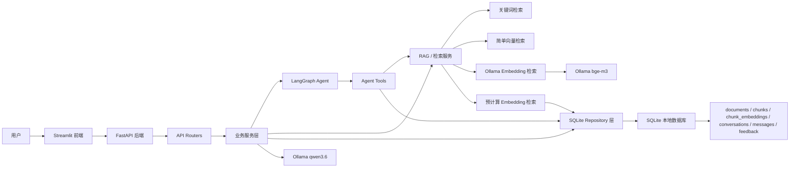
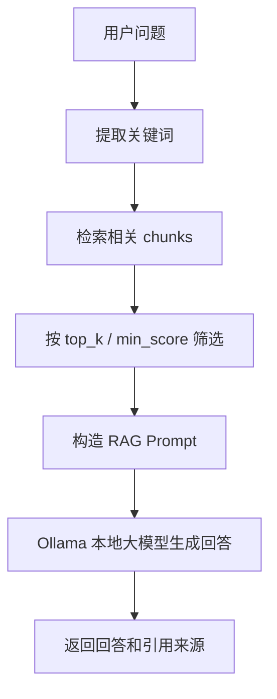
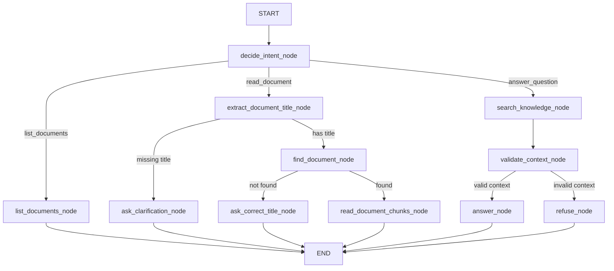

# 企业知识库 Agent 当前架构说明

这份文档记录的是项目当前的真实架构，不是最终生产级架构。它的作用是帮你回答三个问题：

1. 用户从前端提问后，代码是怎么一层层工作的？
2. 普通 RAG、Simple Agent、LangGraph Agent 分别在项目里处于什么位置？
3. 当前项目距离最终交付还缺哪些工程化能力？

当前项目可以理解为一个“本地可运行的企业知识库 Agent 原型”：它已经具备 FastAPI 后端、Streamlit 前端、SQLite 数据库、RAG 检索、Ollama 本地大模型、Embedding 检索、LangGraph Agent 编排、会话消息存储、会话摘要记忆和自动化测试，但还没有进入完整生产部署阶段。

## 一、整体架构图



这张图可以先不用追求一次完全背下来。你只要先记住主线：

用户页面发请求 → FastAPI 接收请求 → Router 分发 → Service 处理业务 → Repository 读写 SQLite → RAG/Agent 决定回答 → 返回给前端。

## 二、代码分层

当前项目大致分成 5 层：

| 层级 | 代表目录 / 文件 | 主要职责 |
| --- | --- | --- |
| 前端层 | `frontend/streamlit_app.py`、`frontend/admin_documents.py`、`frontend/admin_feedback.py` | 提供聊天页面、文档管理页面和反馈管理页面 |
| API 层 | `backend/main.py`、`backend/routers/*.py` | 接收 HTTP 请求，处理参数，调用服务层，返回 JSON |
| 业务服务层 | `backend/services/*.py` | 实现 RAG、Agent、文档索引、反馈、会话上下文等核心逻辑 |
| 数据访问层 | `sqlite_*_repository.py` | 专门负责和 SQLite 数据库打交道 |
| 学习与运维层 | `week01` 到 `week10`、`scripts/*.ps1`、`docs/*.md` | 保存学习过程、调试脚本、迁移脚本、运行手册和项目文档 |

你以后读代码时，可以先问自己一句：

“我现在看的这段代码，是在接收请求、处理业务、还是读写数据库？”

这个问题非常重要，因为它能帮你避免把所有代码混在一起看。

## 三、FastAPI 后端结构

后端入口是：

```text
backend/main.py
```

它主要负责创建 FastAPI 应用，并注册多个 router：

| Router | 主要功能 |
| --- | --- |
| `health.py` | 健康检查 |
| `info.py` | 返回当前项目能力清单 |
| `chat.py` | 早期普通 RAG 问答 |
| `documents.py` | 早期 JSON 文档接口 |
| `db_documents.py` | SQLite 文档、chunks、上传和索引接口 |
| `feedback.py` | 用户反馈保存、查询和统计 |
| `conversations.py` | 会话创建、查询和消息读取 |
| `agent.py` | Simple Agent 接口 |
| `langgraph_agent.py` | LangGraph Agent 接口 |
| `memory_demo.py` | LangGraph 短期记忆演示接口 |

这里你可以把 Router 理解成“前台接待员”：它知道用户请求的是哪个窗口，但真正复杂的事情会交给 services 完成。

## 四、数据存储结构

当前项目使用 SQLite 作为本地数据库。它适合学习、原型验证和本地演示，但后续生产化会升级到 PostgreSQL + pgvector。

当前主要表包括：

| 表名 | 作用 |
| --- | --- |
| `documents` | 保存文档基本信息，例如标题、文件类型、chunk 数量、是否已索引 |
| `chunks` | 保存文档切分后的片段 |
| `chunk_embeddings` | 保存每个 chunk 的 embedding 向量 |
| `conversations` | 保存会话，以及会话级 `summary` 摘要 |
| `messages` | 保存每轮用户和助手消息，并保存消息级 `metadata` |
| `feedback` | 保存用户对回答的反馈 |

其中最核心的是：

```text
documents 1 ---- N chunks
chunks 1 ---- 1 chunk_embeddings
conversations 1 ---- N messages
```

换成人话就是：

- 一份文档可以切成多个片段。
- 一个片段可以有一个对应的 embedding。
- 一个会话里可以有多条消息。
- 一个会话可以有一个 summary，用来压缩该会话的历史上下文。

## 五、RAG 问答链路

普通 RAG 的核心流程是：



当前项目支持多种检索模式：

| 检索模式 | 说明 | 当前定位 |
| --- | --- | --- |
| `keyword` | SQL LIKE 关键词检索 | 最简单、最快，但语义能力弱 |
| `vector` | 基于 jieba 分词和词频向量 | 学习向量思想用，适合解释原理 |
| `embedding` | 每次调用 Ollama 生成 embedding 后检索 | 语义能力更强，但较慢 |
| `precomputed_embedding` | 预先把 chunk embedding 存到 SQLite，查询时只算问题 embedding | 当前推荐的本地语义检索模式 |

这也是你目前已经跨过的一个关键门槛：你不只是“调用大模型”，而是已经做到了“先检索，再带引用回答”。

## 六、LangGraph Agent 架构

LangGraph Agent 是当前项目里最接近“Agent 应用开发工程师”方向的部分。它不只是单次 RAG，而是把不同动作拆成节点，由图来决定下一步走哪里。

当前主文件是：

```text
backend/services/langgraph_agent.py
```

Agent 当前支持三类主要意图：

| 意图 | 说明 |
| --- | --- |
| `list_documents` | 列出知识库已有文档 |
| `read_document` | 根据文档标题读取文档片段 |
| `answer_question` | 检索知识库并回答问题 |

### LangGraph 流程图



你可以把它理解成一个小型工作流：

1. 先判断用户想做什么。
2. 如果是查文档列表，就调用列文档工具。
3. 如果是读某份文档，就先提取标题，再查文档，再读 chunks。
4. 如果是问答，就先检索，再判断上下文是否可信。
5. 有可信上下文才回答，没有可信上下文就拒答。

## 七、Agent Tools 的作用

Agent Tools 在这里扮演“可调用工具”的角色。当前主要在：

```text
backend/services/agent_tools.py
```

它们包括：

| 工具 | 作用 |
| --- | --- |
| `list_documents_tool` | 查看知识库文档列表 |
| `find_document_by_title_tool` | 根据标题查找文档，支持精确匹配和部分匹配 |
| `read_document_chunks_tool` | 读取某份文档的 chunks |
| `search_knowledge_base_tool` | 按指定检索模式搜索知识库 |
| `answer_with_context_tool` | 基于上下文生成带引用回答 |
| `refuse_answer_tool` | 没有可靠依据时拒答 |
| `ask_clarification_tool` | 缺少必要信息时要求用户补充 |

这也是普通 RAG 和 Agent 的核心区别：

- 普通 RAG：基本是一条固定流水线。
- Agent：会先判断意图，再决定调用哪个工具和走哪条路径。

## 八、会话上下文与“有限长期记忆”

当前项目已经具备一个安全版长期记忆雏形，但还不是完整长期记忆系统。

当前已经支持：

1. 创建 conversation。
2. 保存 user / assistant messages。
3. assistant message 保存 metadata，例如：
   - `intent`
   - `keyword`
   - `citations`
   - `steps`
4. 根据 messages 生成 conversation summary，并写回 `conversations.summary`。
5. LangGraph Agent 每轮开始时会读取旧 summary，并在 `steps` 中记录 `load_conversation_summary`。
6. 对“每天需要工作多久？”这类省略主语的问题，可以结合最近引用文档或 summary 构造 contextual question。
7. 如果当前问题和历史上下文不相关，会拒绝使用历史上下文，避免上下文污染。
8. Streamlit 页面可以显示当前会话摘要。
9. `week10/backfill_conversation_summaries.py` 可以给旧会话补齐 summary。

相关核心文件：

```text
backend/services/conversation_context_service.py
backend/services/conversation_summary_service.py
backend/services/sqlite_conversation_repository.py
backend/routers/conversations.py
backend/routers/langgraph_agent.py
week10/backfill_conversation_summaries.py
```

当前能力更准确地说是：

```text
基于 messages、metadata 和 summary 的安全上下文补全
```

暂时还不能称为完整长期记忆，因为它还没有：

- 用户画像记忆
- 跨会话记忆
- 记忆更新策略
- 记忆遗忘策略
- 记忆权限控制

当前设计中，summary 只用于辅助检索方向，不能直接作为最终回答依据。最终回答仍然必须来自知识库 chunks 和 citations。

## 九、前端页面结构

当前 Streamlit 前端主要包括：

| 页面 | 文件 | 作用 |
| --- | --- | --- |
| 用户聊天页 | `frontend/streamlit_app.py` | 提问、选择问答引擎、提交反馈、上传文档 |
| 文档管理页 | `frontend/admin_documents.py` | 查看文档、chunks、embedding 状态、触发补齐 |
| 反馈管理页 | `frontend/admin_feedback.py` | 查看用户反馈和反馈统计 |

当前前端适合本地演示和学习，不是最终企业级 UI。后续如果要更接近真实产品，可以换成 React / Vue，或者继续保留 Streamlit 做内部工具。

## 十、脚本和运维入口

当前常用脚本在：

```text
scripts/
```

| 脚本 | 作用 |
| --- | --- |
| `check_project.ps1` | 执行 SQLite 迁移和全量测试 |
| `migrate_sqlite.ps1` | 执行 SQLite schema 迁移 |
| `start_backend.ps1` | 启动 FastAPI 后端 |
| `start_frontend.ps1` | 启动 Streamlit 用户页面 |
| `start_admin_documents.ps1` | 启动文档管理页面 |
| `start_admin_feedback.ps1` | 启动反馈管理页面 |

你可以把这些脚本理解成项目的“操作按钮”。项目越复杂，越需要把常用操作沉淀成脚本，否则很容易忘步骤。

## 十一、当前架构的优点

当前项目已经具备几个非常重要的工程能力：

1. 有清晰的前后端分层。
2. 有 API、Service、Repository 的基本分层。
3. 有 RAG 检索和引用回答。
4. 有拒答机制，避免无依据编造。
5. 有多种检索模式对比。
6. 有预计算 embedding，开始接近真实 RAG 系统。
7. 有 LangGraph Agent 工作流。
8. 有可观察的 Agent steps。
9. 有会话消息和 metadata 存储。
10. 有自动化测试保护重构。
11. 有运行脚本、配置文档和迁移脚本。

这些能力已经超过“只会调 API 的 Demo”，更接近一个工程化原型。

## 十二、当前架构的不足

当前项目仍然不是最终生产级系统，主要缺口有：

1. 数据库还是 SQLite，没有升级到 PostgreSQL + pgvector。
2. 还没有 Docker Compose 一键启动全部服务。
3. 还没有 GitHub Actions 自动测试。
4. 还没有线上部署地址。
5. 文件解析能力还比较基础，主要围绕 txt / 手动内容。
6. 权限、用户体系、租户隔离还没有做。
7. 长期记忆仍是安全版雏形，还没有用户画像、跨会话记忆和权限控制。
8. RAG 评测集还不完整。
9. 日志、监控、限流、安全防护还比较薄。
10. README、架构图、演示视频、简历项目描述还没有最终收尾。

这不是坏事。它说明当前项目已经进入“从能跑，到能交付”的阶段。

## 十三、下一阶段建议

建议后续按这个顺序推进：

1. 继续完善会话长期记忆：摘要质量、跨轮上下文、污染防护和记忆策略。
2. 补齐 RAG 评测集：有答案、无答案、提示词攻击、上下文污染、检索命中。
3. 引入 Docker Compose：统一启动后端、前端、数据库和本地依赖。
4. 升级 PostgreSQL + pgvector：替换 SQLite embedding 检索。
5. 增加 GitHub Actions：每次提交自动运行测试。
6. 最后再做 README、架构图、演示视频和简历项目总结。

你现在最需要掌握的不是“背会所有代码”，而是能讲清楚这条主线：

```text
用户问题 → API → Agent 读取 summary → 判断意图 → 工具调用 → 检索知识库 → 上下文校验 → 回答或拒答 → 保存会话、metadata 和 summary
```

这条主线，就是当前项目的骨架。
